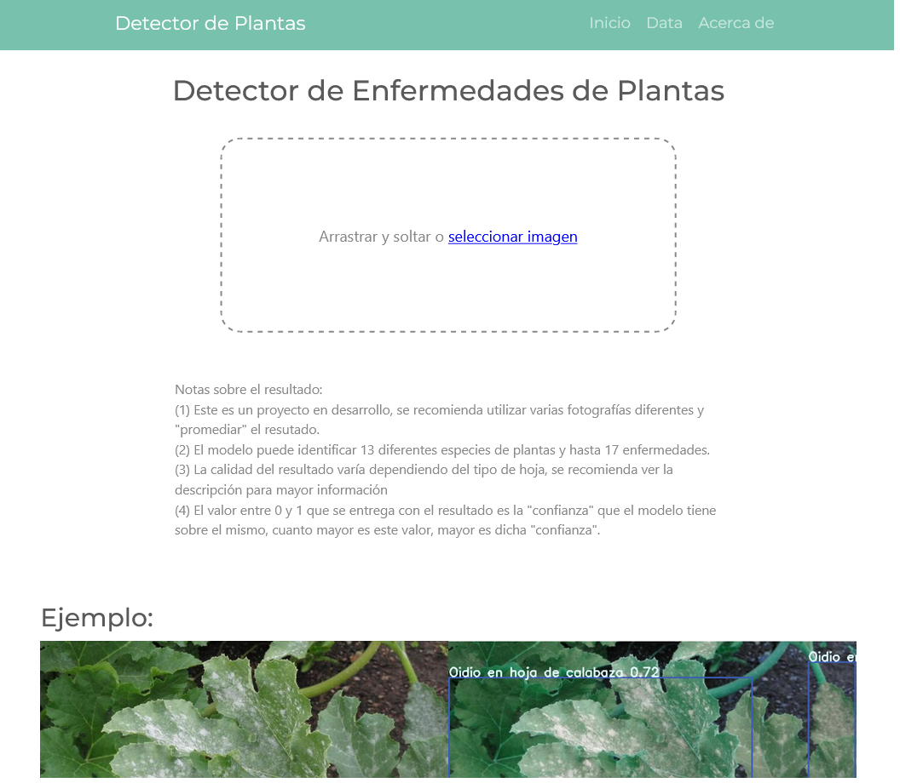
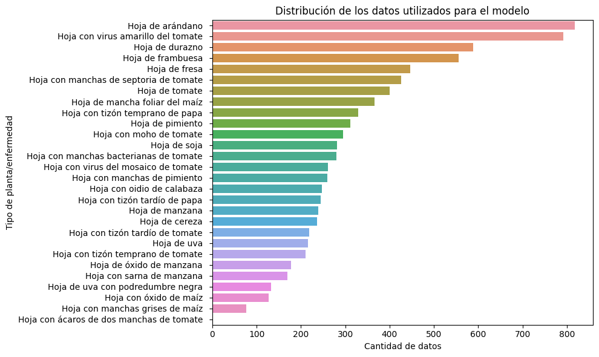
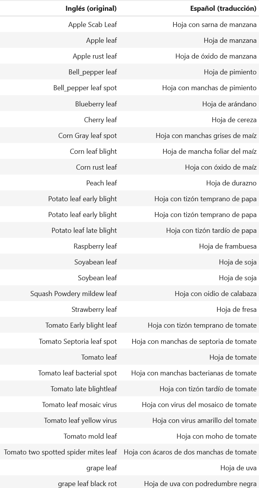

# Detector de Enfermedades de Plantas

## Resumen del proyecto

* Se construye una página web que permite subir una fotografía de las hojas de una planta y, a partir de esta,  detectar el tipo de hoja y el tipo de enfermedad en la misma.
* Para tal propósito se usó el algoritmo de detección de objetos [**YOLOv7**](https://arxiv.org/abs/2207.02696) y su implementación open-source hecha por [Wong Kin Yiu](https://github.com/WongKinYiu/yolov7).
* El algoritmo está implementado en Pythorch, pero la inferencia se realiza usando el formato **ONNX**. Para detalles sobre el proceso de entrenamiento visitar: [yolov7_plantdoc](https://github.com/a-jimenezc/yolov7_plantdoc).
* La base de datos utilizada fue: [PlantDoc: A Dataset for Visual Plant Disease Detection](https://github.com/pratikkayal/PlantDoc-Dataset). En esta se tienen **13 especies** y hasta **17 enfermedades diferentes**.
* La página web se desplegó utilizando **Docker** y el servicio *serverless* de **Google Cloud Platfom**: Cloud Run.

## Requerimientos

* **Versión de Python:** 3.9
* **Librerias:** numpy, pandas, open-cv, dash, ONNX runtime.
* **Instalación:** requirements.txt

## Página Web

El siguiente es el enlace a la página web, hosting provisto por Google Cloud:

[plant-disease-app-q3sojgpqiq-uc.a.run.app](https://plant-disease-app-q3sojgpqiq-uc.a.run.app/)

 

## Base de datos: Plantdoc
* se tienen 28 diferentes clases, con la siguiente distribución.
  
  

* La base de datos original se encuentrá en inglés, por lo que fue necesario traducir. A continuación se detallan las traducciones utilizadas:

  

## Siguientes pasos

Es necesario recolectar datos de diferentes especies y enfermedades relevantes en nuestra región. Con esto se puede asegurar una mayor utilidad en la herremienta.

También es necesario aplicar técnicas de *data augmentation* to improve model performance.

## Licencia 

GNU Affero General Public License v3.0

## Autor

Antonio Jimenez Caballero

## Contacto

[Linkedin](https://www.linkedin.com/in/antonio-jimnzc/)
